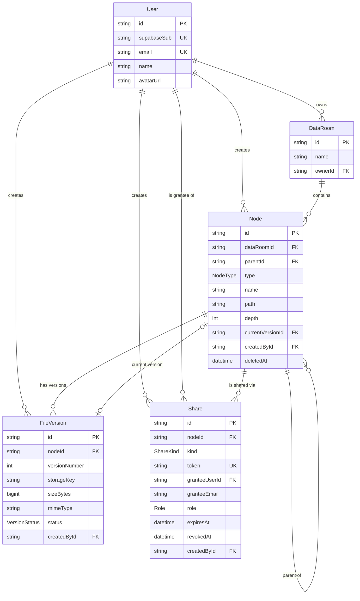

# Data Room

A Data Room MVP — an organized, securely shareable document repository in the
spirit of Google Drive/Dropbox/Box, where a Data Room is the top-level drive.
Built as a take-home submission: NestJS API, Next.js frontend, Postgres +
object storage + auth all on Supabase.

- **Web app:** <!-- DEPLOYED_WEB_URL -->
- **API:** <!-- DEPLOYED_API_URL --> (Swagger at `/docs`)
- **Demo login:** <!-- DEMO_CREDENTIALS -->

## Contents

- [Screenshots](#screenshots)
- [Quick start](#quick-start)
- [Design decisions](#design-decisions)
- [Data model / ERD](#data-model--erd)
- [How it scales](#how-it-scales)
- [Testing](#testing)
- [Where AI was used](#where-ai-was-used)
- [Known limitations](#known-limitations)

## Screenshots

Not included in this commit. The set captured during development was taken
before a font-loading bug fix (`--font-sans` resolved to itself, so the whole
app rendered in the browser's default serif font instead of Geist) and before
a share-link regression was fixed, so every one of them misrepresents the
current UI in some way — wrong typeface, a mid-dialog blur, or a broken
"Not found" state on a feature that now works. Shipping them would be
misleading rather than helpful.

Once the app is deployed (see placeholders above), retaking a small set —
folder browser, an upload in progress, the share dialog, the public link
view — against production is the next step; they'll be committed to
`docs/screenshots/` and linked here.

## Quick start

### Prerequisites

- Node.js 20+
- pnpm 9+ (`corepack enable` will pick up the pinned `9.12.0` from
  `package.json`)
- Docker (only needed to run the API's e2e test suite against a disposable
  local Postgres)
- A Supabase project (free tier is enough) — Auth, Postgres, and Storage all
  come from the same project

### 1. Supabase setup

1. Create a project at supabase.com.
2. **Database:** copy the pooled connection string into `DATABASE_URL` and
   the direct connection string into `DIRECT_URL` (Project Settings →
   Database).
3. **Auth:** enable Email/Password, and enable the Google provider if you
   want social sign-in (needs a Google OAuth client id/secret — optional).
4. **Storage:** create a **private** bucket. Its name goes in
   `STORAGE_BUCKET`.
5. Copy the project URL and anon key for the web app's env vars, and the
   service-role key and JWKS URL for the API's.

### 2. Install and configure

```bash
git clone https://github.com/annnnnet/data-room.git
cd data-room
corepack enable
pnpm install
cp apps/api/.env.example apps/api/.env
cp apps/web/.env.example apps/web/.env.local
```

Fill in the env files:

**`apps/api/.env`**

| Var | Description |
|---|---|
| `DATABASE_URL` | Pooled Postgres connection string (Supabase) |
| `DIRECT_URL` | Direct (non-pooled) connection string, used by migrations |
| `DATABASE_URL_TEST` / `DIRECT_URL_TEST` | Local Docker Postgres for the e2e suite — the values in `.env.example` already match `docker-compose.yml`, no edits needed |
| `SUPABASE_URL` | Supabase project URL |
| `SUPABASE_SERVICE_ROLE_KEY` | Service-role key (server-side only, never exposed to the browser) |
| `SUPABASE_JWKS_URL` | `https://<project>.supabase.co/auth/v1/.well-known/jwks.json` — used to verify access tokens |
| `STORAGE_BUCKET` | Name of the private Storage bucket created above |
| `WEB_ORIGIN` | Origin(s) allowed by CORS, comma-separated (`http://localhost:3000` locally) |
| `PORT` | API port (defaults to `4000`) |

**`apps/web/.env.local`**

| Var | Description |
|---|---|
| `NEXT_PUBLIC_API_URL` | Base URL of the API, e.g. `http://localhost:4000` |
| `NEXT_PUBLIC_SUPABASE_URL` | Same Supabase project URL |
| `NEXT_PUBLIC_SUPABASE_ANON_KEY` | Supabase anon (public) key |

### 3. Migrate and seed

```bash
pnpm --filter @data-room/api exec prisma migrate deploy
SEED_SUPABASE_SUB=<supabase-user-id-of-a-signed-up-demo-account> \
  pnpm --filter @data-room/api exec prisma db seed
```

The seed script upserts a demo Data Room ("Acme Acquisition" with a few
folders) onto a demo user identified by email (`demo@acme.test`). It needs
`SEED_SUPABASE_SUB` — the Supabase auth user id — because the local `User`
row is keyed off the Supabase subject claim; sign up once through the app
(or the Supabase dashboard) first, then pass that user's id. Re-running the
seed is safe — it upserts on stable, deterministic ids rather than creating
duplicates.

### 4. Run

```bash
pnpm dev
```

This runs both apps in parallel: API on `http://localhost:4000` (Swagger at
`/docs`), web on `http://localhost:3000`.

### Running the test suites

```bash
pnpm -r test                              # shared + API unit + web unit
pnpm test:e2e:db:up                       # starts a disposable Postgres in Docker
pnpm --filter @data-room/api test:e2e     # API e2e, against that database
pnpm test:e2e:db:down
pnpm --filter @data-room/api test:dist-boot   # boots the built dist/ under plain node
pnpm --filter web test:e2e                # Playwright smoke test (starts its own dev servers)
```

## Design decisions

**One `Node` table for folders and files.** A `type` discriminator
(`FOLDER` | `FILE`) instead of separate tables means listing is one paginated
query with folders sorted first, sharing is one `Share.nodeId` column that
covers a Data Room, a folder, or a single file (a Data Room share is just a
share on its root node), search is one index, and move/rename is one code
path. The cost is a few nullable file-only columns (`currentVersionId`) on
folder rows — a small price for not maintaining two parallel object models.

**Materialized path.** `Node.path` stores the ancestor chain as
`/rootId/childId/.../nodeId/` — leading *and* trailing slashes. The trailing
slash matters: `LIKE 'path%'` is how every subtree query is expressed, and
without a trailing delimiter a prefix like `/room1/folder1` would also match
an unrelated sibling `/room1/folder10/`. With it, a subtree scan is one
index-backed `WHERE path LIKE '<node.path>%'`, breadcrumbs come from parsing
the ancestor ids out of the string, and access inheritance is one `IN` query
against `Share` — no recursive CTE, no per-request tree walk. The trade-off
is that moving a folder rewrites every descendant's `path` in the same
transaction as the `parentId` update; moves are rare, reads are constant.

**Direct-to-storage uploads.** Bytes never pass through the API process.
The browser asks for a short-lived Supabase signed upload URL, `PUT`s the
file straight to Storage, then calls `complete` to flip the `FileVersion`
from `PENDING` to `READY` and repoint `Node.currentVersionId`. This avoids
host body-size limits and request timeouts on the API, and keeps the API
stateless. It also means a file is invisible in listings until `complete`
succeeds — an interrupted upload just leaves an orphaned pending version,
harmless but not yet swept (see Known limitations).

**404, never 403, on denial.** `AccessService` resolves a caller's role
against a node; if there's no match, it returns `404 NODE_NOT_FOUND` rather
than `403 FORBIDDEN`. A 403 confirms the id exists and something is being
withheld; a 404 doesn't. This applies uniformly whether the caller is a
stranger, a revoked share, or an expired one.

**One guard for both credential types.** `AuthGuard` populates
`req.principal` from either a Supabase bearer JWT (`{ userId }`) or an
`X-Share-Token` header (`{ shareToken }`). Everything downstream —
`AccessService`, controllers — treats a public-link visitor as simply a
principal without a user id. This is why sharing doesn't duplicate the
endpoint surface with a parallel "public" API.

**Soft delete.** `Node.deletedAt`. Deleting a folder stamps its entire
subtree in one path-prefix `UPDATE`, not just the target node — a naive
"only stamp the row you clicked" implementation would leave descendants
reachable, since access checks are per-node. This turns "the folder you're
viewing was deleted" into a clean `410 GONE` instead of a dangling reference,
and keeps the partial unique index on `(parentId, lower(name))` correct — a
deleted name is immediately reusable.

**Additive restore.** Restoring a file version doesn't overwrite anything —
it creates a *new* `FileVersion` pointing at the old blob's `storageKey` and
repoints `currentVersionId`. History is never destroyed; "restore" is really
"promote an old version to current, keeping the whole chain intact."

## Data model / ERD



### Indexes that matter

| Index | Serves |
|---|---|
| `(parentId, type, name)` on `Node` | folder listing + keyset pagination (folders before files, alphabetical) |
| `(path)` and `(path text_pattern_ops)` on `Node` | subtree stats, cascade soft-delete, move — a plain btree can't serve `LIKE 'prefix%'` under a non-`C` collation, hence the second index |
| `(dataRoomId)` on `Node` | room-scoped queries |
| GIN `pg_trgm` on `lower(name)` on `Node` | search — see the note under How it scales |
| unique `(token)` on `Share` | public link resolution |
| `(granteeUserId)`, `(granteeEmail)` on `Share` | "shared with me" / pending-invite lookups |
| partial unique `(parentId, lower(name)) WHERE deletedAt IS NULL` | enforced-in-the-database name conflicts; a deleted name is immediately reusable |

## How it scales

**1. Computing a folder's total size and item count including its whole
subtree.** The materialized path makes this a single index-backed query:
`WHERE path LIKE '<node.path>%'` feeding `COUNT(*)` and `SUM(sizeBytes)` —
no recursive CTE, no walking the tree in application code. That's what ships
today (`GET /nodes/:id/stats`). If write volume ever outgrows read volume
enough that aggregating on every request becomes expensive, the next step is
denormalized rollup counters on `Node` (fileCount, folderCount, totalBytes),
maintained in the same transaction as any create/delete/move, with the
prefix-query version kept around as a reconciliation job to catch drift.

**2. What changes at 100,000 files in one Data Room.** Pagination is already
keyset, not offset — the cursor encodes `(type, name, id)`, the exact tuple
the covering index sorts by, so a deep page is a seek, not a scan (`OFFSET
99000` would scan 99,000 rows to throw them away). The `(parentId, type,
name)` index already backs that. What would need to change: folder stats
move from the live prefix-aggregate to the rollup counters described above,
so listing a folder never has to aggregate a 100k-row subtree; the table
virtualizes rows on the client instead of rendering every row in the DOM;
and search leans entirely on the `pg_trgm` GIN index rather than any
sequential fallback.

**3. Extending sharing to per-user roles (viewer/editor) without
remodeling.** `Share.role` is already an enum with one variant (`VIEWER`).
Adding `EDITOR` is a migration that adds the enum variant plus a one-line
predicate change in `AccessService` (mutations currently require `role =
OWNER`; that becomes `role IN (OWNER, EDITOR)`). No table changes, no new
relationships — the sharing mechanism, resolution order (owner → direct
share → inherited share → link), and the 404-not-403 denial behavior are all
already role-agnostic.

## Testing

Coverage is targeted at the security-critical and conflict-prone paths
rather than exhaustive:

- **`AccessService` unit tests** — owner, direct share, share inherited from
  an ancestor, link token, revoked share, expired share, stranger,
  soft-deleted node.
- **API e2e** (Jest + supertest, against a disposable Postgres in Docker) —
  name-conflict versioning, subtree soft-delete, move-into-descendant
  rejection, keyset pagination correctness, 404-not-403 on denial, the
  anonymous cross-tenant and IDOR fixes described below (regression-covered).
- **Web unit tests** (Vitest + Testing Library) — dialogs, the upload queue
  reducer, breadcrumb building, the conflict-name resolver, search, share
  tabs, the public-share breadcrumb trim.
- **API dist-boot check** — boots the actual built `dist/src/main.js` under
  plain `node` (not Jest, not source) and asserts a real `401` — this is
  what caught two separate "162 tests pass but the app cannot boot" bugs
  (see below).
- **One Playwright smoke test** — signs in, creates a Data Room, uploads a
  file, creates a share link, opens it in a fresh browser context, and
  verifies read-only access. It starts its own dev servers if none are
  running, so it works from a cold clone.

Current counts (last run against this branch): **4** shared, **76** API
unit, **89** API e2e, **141** web unit, plus the dist-boot check and the
Playwright smoke test, all green.

```bash
pnpm -r test
pnpm test:e2e:db:up && pnpm --filter @data-room/api test:e2e && pnpm test:e2e:db:down
pnpm --filter @data-room/api build && pnpm --filter @data-room/api test:dist-boot
pnpm --filter web test:e2e
```

## Where AI was used

This project was built with an AI agent workflow, end to end: a design spec
was written up front (architecture, data model, API surface, work plan),
then each task in that plan was implemented by a subagent and independently
reviewed by a separate, adversarial reviewer agent before moving on.
Security-critical protections (the access-control guard, the ownership
checks in mutations) were mutation-tested — the reviewer would remove the
protection, confirm the relevant test actually failed, then restore it —
specifically to catch tests that assert nothing.

That process caught real bugs, and I think a reviewer would want to know
about them rather than have them papered over:

- An **anonymous cross-tenant data leak** via an unvalidated context token
  in the share-resolution path.
- An **IDOR in the upload-complete endpoint** — the initial implementation
  didn't verify the caller had rights to the version being completed.
- An **authorization test suite that would have passed with authorization
  removed entirely** — mutation-testing the guard is what surfaced this.
- A **trigram search index that was silently never used** — Prisma's
  `mode: 'insensitive'` compiles to `ILIKE`, but the index was built on
  `lower(name)`; `EXPLAIN` showed a sequential scan at 70.6ms over 60k rows.
  Rebuilding the index as an expression index matching what `ILIKE` actually
  needs dropped that to a bitmap index scan at 2.3ms.
- **Two separate bugs that made the app unable to boot at all**, while 162
  Jest/Vitest tests passed — `packages/shared` was shipping raw TypeScript
  that plain `node` can't `require`, and a provider was never exported from
  its module so dependency injection failed outside the test harness's
  guard overrides. Neither was visible to the test suite because Jest
  transpiles TypeScript on the fly and every e2e test overrode the guard.
  That's what motivated the dist-boot check and a `bootstrap.e2e-spec.ts`
  with zero overrides.

What I (the human) decided versus what the agent produced: the scope,
priorities, and stack choices in the design spec are mine — what ships vs.
what's explicitly out of scope, the single-vendor Supabase rationale, the
one-`Node`-table and materialized-path decisions, and the target effort
budget. The agent produced the implementation, the test suites, and the
adversarial review passes against that spec, including catching the bugs
listed above. I reviewed the diffs task by task rather than accepting a
single large change at the end, and this README itself was drafted by an
agent from the design spec and progress log, then fact-checked against the
actual repo (running the test suites, reading the schema and source
directly) rather than trusted from memory — dependency versions and test
counts in earlier drafts of the plan turned out to be wrong (Prisma pinned
to 6.19.3, not 5.x, because v7 drops `url`/`directUrl` from the datasource
block; Next.js is 16.3.2, not 14) and were corrected against the code before
writing them here.

## Known limitations

- **No sweeper for orphaned pending uploads or blobs.** An interrupted
  upload leaves a `PENDING` `FileVersion` row and possibly an orphaned
  object in Storage. Both are invisible (never surfaced in listings) but
  not cleaned up; a periodic job is the natural next step.
- **No trash/restore UI for deleted nodes.** Soft delete exists server-side
  (`Node.deletedAt`) but nothing in the UI lets an owner browse or undelete
  a removed node. (Restoring a *file version* is a separate, shipped
  feature — see Design decisions.)
- **Google OAuth requires a configured client id** in the Supabase project;
  without one, only email/password sign-in works.
- **Version history is owner-only by design** — a share recipient, even
  with link access to a file, cannot see or restore prior versions.
- **Single-region storage** — no redundancy or multi-region replication
  beyond whatever Supabase's free tier provides.
- **No editor/commenter role** — the data model and `AccessService` already
  accommodate it (see How it scales, #3), but no UI ships for it.
